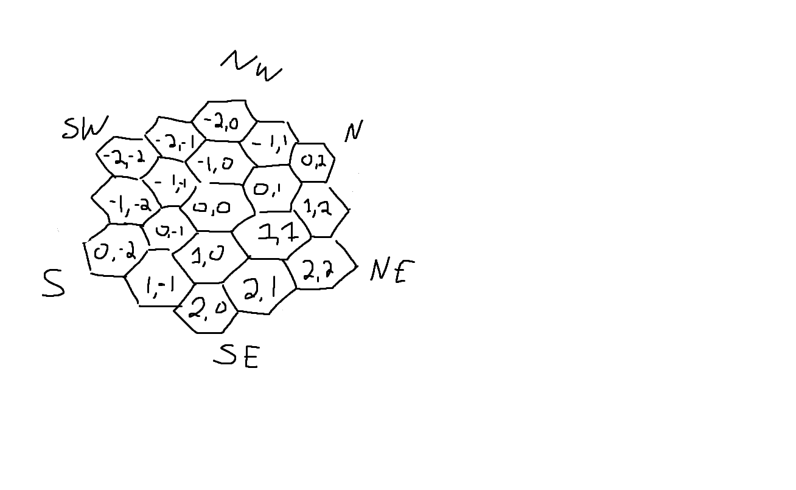

# Weather_Flowers

Weather_Flowers is a class for creating an array of weather events

## Installation

This section should probably be added.

## Usage

```javascript
import WeatherFlower

// attributes within WeatherFlower
WeatherFlower.SPRING
WeatherFlower.SUMMER
WeatherFlower.AUTUMN
WeatherFlower.WINTER

// returns the average hazard value of all attributes
averageHazardOverDays( days );

// returns an object containing a string for printout and an array 
// containing a WeatherHex object which contains both the weather and hazard level
WeatherFlower.SPRING.generateForecast( days, start_location );
// ...
WeatherFlower.AUTUMN.generateForecast( days, start_location );
```

## Empty Constructors for Season class 

```javascript
const _HEX_MAP = new Map([
    // Center
    ['0,0', new WeatherHex('', false)],

    // 1st Ring
    ['0,1', new WeatherHex('', false)],
    ['1,1', new WeatherHex('', false)],
    ['1,0', new WeatherHex('', false)],
    ['0,-1', new WeatherHex('', false)],
    ['-1,-1', new WeatherHex('', false)],
    ['-1,0', new WeatherHex('', false)],

    // 2nd Ring
    ['0,2', new WeatherHex('', false)],
    ['1,2', new WeatherHex('', false)],
    ['2,2', new WeatherHex('', false)],
    ['2,1', new WeatherHex('', false)],
    ['2,0', new WeatherHex('', false)],
    ['1,-1', new WeatherHex('', false)],
    ['0,-2', new WeatherHex('', false)],
    ['-1,-2', new WeatherHex('', false)],
    ['-2,-2', new WeatherHex('', false)],
    ['-2,-1', new WeatherHex('', false)],
    ['-2,0', new WeatherHex('', false)],
    ['-1,1', new WeatherHex('', false)]
]);
const _EXCEPTIONS = new Map([
    ['', ['']],
    ['', ['']],
    ['', ['']],
    ['', ['']],
    ['', ['']],
    ['', ['']],
    ['', ['']],
    ['', ['']]
])
const _START_LOCATIONS = new Map([
    [2, ''],
    [3, ''],
    [4, ''],
    [5, ''],
    [6, ''],
    [7, ''],
    [8, ''],
    [9, ''],
    [10, ''],
    [11, ''],
    [12, '']
]);
```
## Coordinate Diagram



## Contributing

Pull requests are welcome. For major changes, please open an issue first
to discuss what you would like to change.

## Credits

This is based on the weather generator created by reddit user [/u/KorbohneD](https://www.reddit.com/user/KorbohneD)

The specific thread is linked [here](https://www.reddit.com/r/osr/comments/omtd4g/4_season_weather_table_hex_easy_and_logical/)